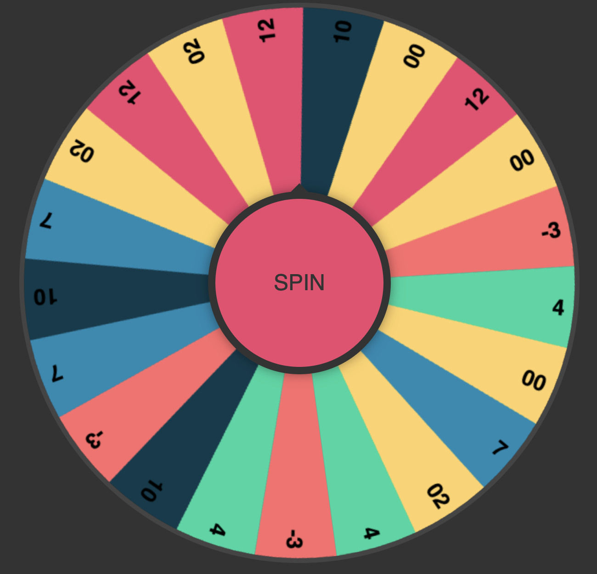

# 🎡 **Grade-O-Matic 3000: Spin Your Way to Academic Justice!** 🎡  

> *Are you tired of endless grading? Exhausted by subjective evaluations? Let the wheel decide!*  

---

## 📖 **Overview**

Welcome to **Grade-O-Matic 3000**, the ultimate solution for teachers who are fed up with spending hours reading essays, projects, and exams. Why bother with rubrics, deep thinking, or fairness when a simple spin of a wheel can do all the hard work for you? 🎉  

The Grade-O-Matic 3000 turns grading into a fun, exciting, and completely random experience. Spin the wheel, and let destiny (or chance) assign grades to your students. Because let’s be honest—*life isn’t fair, so why should grades be?*  

---

## 🕹️ **Features**
- 🎡 **Dynamic Grade Roulette:** A spinning wheel that dishes out grades from A+ to F faster than you can say “due date”!  
- 🎉 **Endless Fun:** Every spin is a surprise. Will it be a glorious A+ or a catastrophic D-? Who knows?!  
- 🤷 **Total Objectivity:** No bias, no stress, no second-guessing. Just pure, unfiltered randomness!  
- ⚡ **Time-Saving:** Free yourself from hours of reading assignments and enjoy more *you-time*.  

---

## 🌟 **Why Use Grade-O-Matic 3000?**
- **Simplify Your Life:** Say goodbye to complicated rubrics and agonizing over borderline cases.  
- **Make Grading Exciting:** Transform the grading process into a game show for *you*!  
- **Foster Student Resilience:** Prepare your students for life’s unpredictability with grades they’ll never see coming.  
- **Totally Fair (Sort of):** Everyone gets an equal chance at success... or failure.  

---

## 🚀 **How to Use**
1. Upload your students' names and assignments into the system.  
2. Spin the Grade-O-Matic 3000 wheel with a simple click.  
3. Watch as the wheel spins dramatically before landing on a random grade.  
4. Deliver the grades with confidence and a straight face.  

## 📸 **Screenshots**

---

## Link to start game:
https://fvhreimert.github.io/Balloonageddon-2-Revenge-of-the-Latex-Legion/

